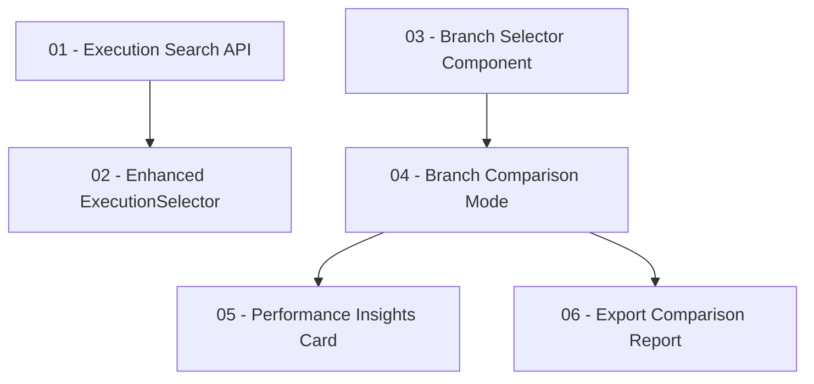

# Compare Page Improvements

This folder contains **production-ready** XML prompts for implementing improvements to the E2E Test Dashboard compare page. Each prompt follows the project's [Prompt Engineering Guide](../../prompt-engineering/README.md) and templates from [prompt-engineering/templates/](../../prompt-engineering/templates/).

## ✅ Production-Ready

All prompts have been updated to be production-ready with:

- ✅ **Proper SQL patterns** - Following existing codebase conventions with `sql.unsafe()` for dynamic WHERE clauses and input sanitization
- ✅ **Type safety** - Importing types from `lib/types.ts` instead of redefining them
- ✅ **Error handling** - Try/catch, graceful error messages, fallbacks
- ✅ **Request cancellation** - AbortController for pending API requests
- ✅ **Accessibility** - ARIA attributes, keyboard navigation, screen reader support
- ✅ **Performance** - Memoization with `useMemo` and `useCallback`
- ✅ **Edge cases** - Empty states, null handling, input validation

## Overview

The compare page currently has issues with search functionality and lacks a branch-first comparison workflow. These prompts break down the improvements into small, focused tasks that can be implemented incrementally.

## Improvement Tasks

| # | File | Priority | Status | Description |
|---|------|----------|--------|-------------|
| 01 | [01_EXECUTION_SEARCH_API.xml](./01_EXECUTION_SEARCH_API.xml) | P0 (High) | ✅ Done | Add server-side execution search API |
| 02 | [02_ENHANCED_EXECUTION_SELECTOR.xml](./02_ENHANCED_EXECUTION_SELECTOR.xml) | P0 (High) | ✅ Done | Connect ExecutionSelector to server-side search |
| 03 | [03_BRANCH_SELECTOR_COMPONENT.xml](./03_BRANCH_SELECTOR_COMPONENT.xml) | P1 (Medium-High) | ✅ Done | Create BranchSelector component with statistics |
| 04 | [04_BRANCH_COMPARISON_MODE.xml](./04_BRANCH_COMPARISON_MODE.xml) | P0 (High) | ✅ Done | Add branch-first comparison mode with tabs |
| 05 | [05_PERFORMANCE_INSIGHTS_CARD.xml](./05_PERFORMANCE_INSIGHTS_CARD.xml) | P2 (Medium) | ✅ Done | Add performance insights section |
| 06 | [06_EXPORT_COMPARISON_REPORT.xml](./06_EXPORT_COMPARISON_REPORT.xml) | P3 (Low) | ✅ Done | Export comparison as Markdown/JSON |

## Dependencies



## Implementation Order

### Phase 1: Core Search Fixes (P0) ✅ Complete
1. ✅ **01_EXECUTION_SEARCH_API.xml** - Created `/api/executions/search` endpoint
2. ✅ **02_ENHANCED_EXECUTION_SELECTOR.xml** - Integrated debounced server-side search

### Phase 2: Branch-First Workflow (P0-P1) ✅ Complete
3. ✅ **03_BRANCH_SELECTOR_COMPONENT.xml** - Built BranchSelector component
4. ✅ **04_BRANCH_COMPARISON_MODE.xml** - Added mode tabs and branch comparison

### Phase 3: Enhanced Results (P2-P3) ✅ Complete
5. ✅ **05_PERFORMANCE_INSIGHTS_CARD.xml** - Added performance insights card
6. ✅ **06_EXPORT_COMPARISON_REPORT.xml** - Enabled export/sharing

## Files Modified by These Tasks

| File | Tasks | Type |
|------|-------|------|
| `lib/db.ts` | 01 | Modify (add `searchExecutions`) |
| `app/api/executions/search/route.ts` | 01 | **New file** |
| `components/dashboard/execution-selector.tsx` | 02 | Modify |
| `components/dashboard/branch-selector.tsx` | 03 | **New file** |
| `app/dashboard/compare/page.tsx` | 04 | Modify |
| `app/dashboard/compare/compare-client.tsx` | 04, 05, 06 | Modify |
| `components/dashboard/performance-insights-card.tsx` | 05 | **New file** |
| `lib/export-comparison.ts` | 06 | **New file** |
| `components/dashboard/export-comparison-button.tsx` | 06 | **New file** |

## Production Patterns Used

### SQL Query Pattern (from existing codebase)
```typescript
// Build conditions array
const conditions = [`organization_id = ${organizationId}`]
if (branch) {
  const sanitizedBranch = branch.replace(/'/g, "''")
  conditions.push(`branch = '${sanitizedBranch}'`)
}
const whereClause = `WHERE ${conditions.join(" AND ")}`

// Execute with sql.unsafe for dynamic WHERE
const result = await sql`
  SELECT * FROM test_executions
  ${sql.unsafe(whereClause)}
  ORDER BY started_at DESC
  LIMIT ${safeLimit}
`
```

### React Hook Pattern
```typescript
// AbortController for request cancellation
useEffect(() => {
  const abortController = new AbortController()
  
  fetch(url, { signal: abortController.signal })
    .then(...)
    .catch((err) => {
      if (err.name === "AbortError") return // Expected
      // Handle real errors
    })
  
  return () => abortController.abort()
}, [dependencies])
```

### Accessibility Pattern
```typescript
<button
  role="tab"
  aria-selected={isActive}
  aria-controls="panel-id"
  onClick={handleClick}
>
  {label}
</button>
```

## Verification Checklist

After implementing each prompt, verify:

- [ ] `npx tsc --noEmit` - No TypeScript errors
- [ ] `npm run lint` - No ESLint errors
- [ ] Manual testing - Features work as described
- [ ] Accessibility - Keyboard navigation works
- [ ] Edge cases - Empty states, errors handled gracefully

## Related Documentation

- [COMPARE_PAGE_IMPROVEMENTS.md](../COMPARE_PAGE_IMPROVEMENTS.md) - High-level improvement plan
- [Prompt Engineering Guide](../../prompt-engineering/README.md) - XML prompt best practices
- [Templates](../../prompt-engineering/templates/) - Templates used for these prompts

---

*Created: 2026-01-06*  
*Updated: 2026-01-06 - All tasks implemented ✅*
